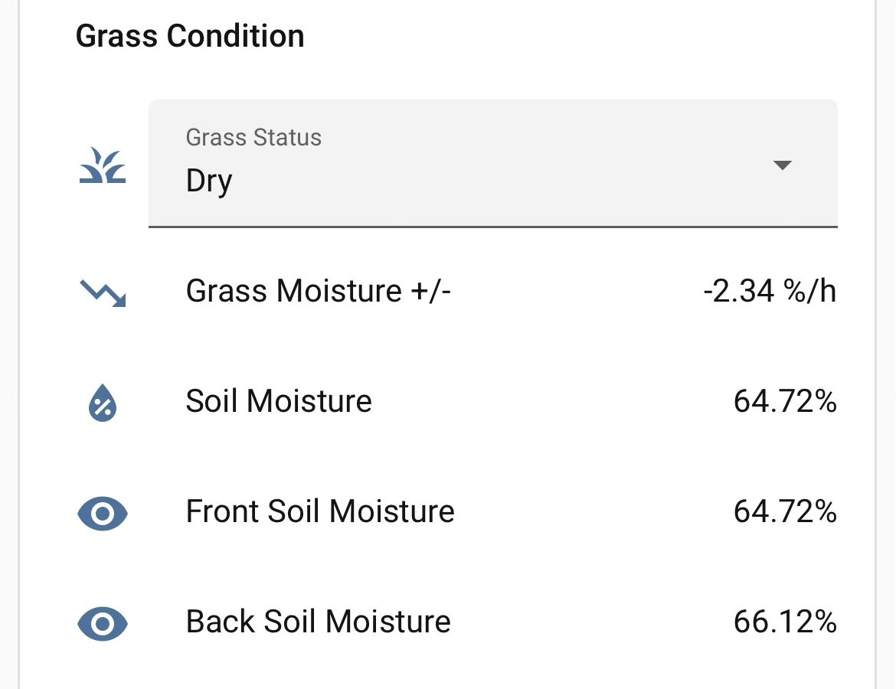

## HA Component Stack

### Host environment

Home Assistant runs as a **Docker container** (`home-assistant`) on a **Raspberry Pi**
running Raspberry Pi OS 64-bit. The container name and Python site-packages path are
referenced in `validate-patches.sh` — adjust them if your setup differs.

### Integrations (installed via Settings → Integrations)

| Integration | Purpose | Entity used |
|---|---|---|
| Ecovacs (with deebot-client patches) | Mower control and state | `lawn_mower.goat_a3000_lidar` |
| PirateWeather | Hourly rain forecast for 95-minute window | `weather.pirateweather` |
| iOS Companion App | Push notifications (critical + regular) | `notify.house_phones` |
| Zigbee (ZHA or Zigbee2MQTT) | Connects the soil moisture sensor | — |
| ESPHome — [Ratgdo32](https://ratcloud.llc/products/ratgdo32) | Garage door open/close control and state | `cover.garage_door` |

> **Ratgdo32** is a Wi-Fi garage door controller that integrates with HA via ESPHome.
> It wires directly to the garage door opener's safety terminals — no cloud required.
> Any HA `cover` entity works as a drop-in replacement; update `cover.garage_door`
> references in `goat_mower_garage.yaml` to match your entity name.

> The Ecovacs integration requires the deebot-client patches in the `/patches` folder to
> work correctly with the A3000. See the repo root README for install instructions.

### HACS frontend cards (required for the dashboard)

| Card | Purpose |
|---|---|
| `custom:button-card` | Day-of-week selector grid (green = scheduled, grey = off) |
| `custom:template-entity-row` | Formatted session status rows (Expected Return, Last Decision, etc.) |

Install both from HACS → Frontend before pasting the dashboard YAML.

### Built-in HA platforms used

| Platform | Purpose |
|---|---|
| `sensor: platform: derivative` | Computes soil moisture rate of change (%/hour) |
| `input_select` | Grass Status (Dry / Wet / Uncertain) and Mow Mode |
| `input_boolean` | Session flags, schedule day toggles, garage tracking |
| `input_datetime` | Scheduled start time, session timestamps |
| `input_text` | Zone IDs, last mowing status label |
| `shell_command` | Writes zone IDs to `/tmp/goat_zones` inside the HA container |

---

## Soil Moisture Sensor

**THIRDREALITY Smart Soil Moisture Sensor Gen2 (Zigbee)**
[Amazon listing](https://www.amazon.com/dp/B0GHNB78F7/ref=twister_B0GN8TYSFF?_encoding=UTF8&psc=1)

Stake it into the lawn in the front yard (or wherever representative of the mowing area).
Pairs via ZHA or Zigbee2MQTT. Once paired, rename the moisture entity to:

```
sensor.front_rain_sensor_soil_moisture
```

or update the entity ID references in `goat_mower_garage.yaml` to match your actual name.

### How it is used

The sensor drives two independent features:

**1. Mowing gate — Grass Status (deterministic)**
`input_select.goat_grass_status` (Dry / Wet / Uncertain) is evaluated before every mow:

| Grass Status | Mowing decision |
|---|---|
| Dry | Allowed — user override respected |
| Wet | Blocked |
| Uncertain | Falls back to raw soil moisture < 55% |

The status is computed automatically from sensor data but can be **manually overridden**
from the dashboard dropdown. A manual selection holds until a rule fires again.

**2. Grass Status rules**

A derivative sensor (`sensor.soil_moisture_rate_of_change`) computes the rate of change
in %/hour over a 30-minute rolling window. Combined with raw moisture, the automation
`GOAT - Update Grass Status` classifies grass condition:

| Rule | Condition | Status |
|---|---|---|
| Floor dry | moisture < 55% | Dry |
| Active drying | moisture < 68% AND rate < −1.5 %/h | Dry |
| Morning wet (before 10 AM) | moisture > 55% AND rate > 0.5 %/h | Wet |
| Day/evening wet (10 AM+) | moisture > 55% AND rate > 2.0 %/h | Wet |
| No rule matches | — | Last recorded status held ("Uncertain" if never set) |

The time-based Wet threshold handles morning dew (slow-forming, 0.5 %/h catches it)
while avoiding false positives from afternoon cloud cover and humidity fluctuations
(which typically stay below 2.0 %/h without actual rain).

Thresholds are starting points — calibrate over a few rain/dry cycles by watching
the sensor history chart.

**3. Mowing block — raw moisture (hard gate)**
Every mow attempt also checks raw soil moisture directly:
- Grass Status = Uncertain AND moisture ≥ 55% → blocked

This provides a fast fallback independent of the derivative sensor.

---

## Mowing decision gates

Every mow attempt (scheduled, manual, makeup) must pass **all three gates**:

| Gate | Blocks if... |
|---|---|
| Grass Status | `Wet` |
| Raw moisture (when Uncertain) | soil moisture ≥ 55% |
| Rain forecast | PirateWeather ≥ 40% precipitation probability in next 95 min |
| Mower error | error sensor ≠ 0 |

A manual **Dry** override bypasses the moisture gate entirely — the user accepts
responsibility if conditions turn out otherwise. The forecast gate is never bypassed.

---

## Scenario 1 — Manual mowing (Press "Start Mowing Now" in the HA dashboard)

1. **Button** calls `script.goat_start_mowing_now`
2. **goat_start_mowing_now** — 5s delay → refresh entity state → weather check
   - If Grass Status = Wet, or (Uncertain + soil moisture ≥ 55%), or rain forecast in next 95 min, or mower error → cancel, notify, done
   - If clear:
     - If mode = **Areas** → `shell_command.goat_write_zones` writes zone IDs to `/tmp/goat_zones`
     - Turns on `goat_departure_window_active` + `goat_mowing_session_active`
     - Records `goat_mowing_session_started_at`
     - Calls `goat_open_garage` (opens door, waits up to 1 min, sets `goat_garage_managed_open`)
     - Calls `lawn_mower.start_mowing` → CleanMowerArea reads zone file (or falls back to auto)
     - Notifies (regular)
3. **Mower → mowing**
   - `GOAT - Close Garage When Mowing Starts` fires (because `departure_window_active` = on) → waits 1 min → closes garage → turns off `departure_window_active`
   - `GOAT - Manual Start Detected` does **not** fire — `mowing_session_active` is already on, condition fails
4. **Mower → returning** — `GOAT - Open Garage When Returning` fires → opens garage, sets status "Returning", notifies (regular)
5. **Mower → docked** — `GOAT - Close Garage When Docked` fires → waits 1 min → closes garage → turns off `mowing_session_active` + `goat_makeup_pending`, notifies (regular)
6. **At session_started_at + 120 min** (fallback) — `GOAT - Not Docked Fallback Alert` fires only if still not docked → **critical** notify

**If anything goes wrong mid-session:**
- Error reported → `GOAT - Error After Mowing Started` → opens garage + tries dock → **critical** notify
- Paused 5+ min → `GOAT - Paused Too Long Return To Dock` → docks → **critical** notify

---

## Scenario 2 — Scheduled mowing (HA is the sole scheduler; Ecovacs app schedules deleted)

1. **`GOAT - Scheduled Start Gatekeeper`** fires every minute via `time_pattern`, checks if
   `now()` matches `input_datetime.goat_mowing_start_time`
   - Condition: `goat_automation_enabled` = on AND today's `goat_schedule_<weekday>` toggle = on
   - Days are set from the dashboard — 7 green/grey buttons (Mon–Sun), tap to toggle
2. Calls `script.goat_mowing_start`
3. **goat_mowing_start** — 10s delay → refresh state → weather + Grass Status check
   - If blocked: Cancel, set `goat_makeup_pending` = on, notify "Mowing cancelled — makeup pending" (regular)
   - If clear:
     - If mode = **Areas** → `shell_command.goat_write_zones` writes zone IDs to `/tmp/goat_zones`
     - Turns on `goat_departure_window_active` + `goat_mowing_session_active`
     - Records `goat_mowing_session_started_at`
     - Calls `goat_open_garage`
     - Calls `lawn_mower.start_mowing` → mower starts immediately (no Ecovacs schedule needed)
     - Notifies "Scheduled mowing started" (regular)
4. **Mower → mowing**
   - `GOAT - Manual Start Detected` does **not** fire — `mowing_session_active` is already on
   - `GOAT - Close Garage When Mowing Starts` fires → waits 1 min → closes garage
5. Steps 4–6 from Scenario 1 apply identically from here

**Unauthorized start** (mower starts via physical button or any path outside HA):
- `GOAT - Manual Start Detected` fires (condition: `mowing_session_active` = off)
- Checks weather → if rain forecast → docks + **critical** notify "Mower stopped due to weather"
- If clear → opens garage, sets `mowing_session_active` on, notifies (regular), closes garage after 1 min

---

## Scenario 3 — Makeup mowing (auto-retry after a weather cancellation)

Triggered when a scheduled mow was cancelled and `goat_makeup_pending` = on.

1. **`GOAT - Makeup Day Check`** fires every hour on the hour, 11am–7pm
   - Conditions: `goat_automation_enabled` = on, `goat_makeup_pending` = on,
     `mowing_session_active` = off, today is **not** a scheduled mowing day
     (scheduled days run via the gatekeeper; makeup only fills non-scheduled gaps)
2. Weather + Grass Status check — same conditions as scheduled mow
   - If still blocked and time is 11am → notify "Makeup mow waiting, will retry hourly" (regular); silent retries each hour after
   - If clear:
     - If mode = **Areas** → writes zone file
     - Turns on `goat_departure_window_active` + `goat_mowing_session_active`
     - Records `goat_mowing_session_started_at`
     - Calls `goat_open_garage`
     - Calls `lawn_mower.start_mowing`
     - Notifies "Makeup mow started" (regular)
3. From here, steps 4–6 from Scenario 1 apply — including clearing `goat_makeup_pending` on dock

**`goat_makeup_pending` lifecycle:**
- Set on: scheduled mow cancelled by weather or Grass Status
- Cleared: any mowing session ends with mower docked (`GOAT - Close Garage When Docked`)
- Also manually toggleable from the dashboard

---

## Weather protection (all scenarios)

Two independent blocking checks run before every mow:

| Check | Source | Block threshold |
|---|---|---|
| Wet grass | `input_select.goat_grass_status` + `sensor.front_rain_sensor_soil_moisture` | Status = Wet, or Uncertain + moisture ≥ 55% |
| Rain forecast | PirateWeather (`weather.pirateweather`), next 95 min | precipitation_probability ≥ 40% or condition in rainy/pouring/lightning |

Use `script.goat_test_weather_check` (Developer Tools → Actions) to run a live check — result appears as a persistent notification showing Grass Status, soil moisture, forecast slots, and the go/cancel decision.

---

## Dashboard layout



Three sections in a vertical-stack:

1. **Entities card** (title: GOAT Mowing Schedule)
   - GOAT Automation Enabled toggle
   - GOAT Status
   - *Scheduled Auto-Mowing* section: Start Time · Mow Mode · Zone IDs

2. **7-column button grid** (`custom:button-card`) — Mon Tue Wed Thu Fri Sat Sun
   - Green = scheduled, grey = off; tap to toggle

3. **Entities card** (title: Manual Run / Mowing Status)
   - *Manual Mowing* section: Start Mowing Now button
   - *Grass Condition* section: Grass Status (editable dropdown) · Grass Moisture +/- · Soil Moisture · Front Soil Moisture · Back Soil Moisture
   - *Session Status* section: Departure Window Active · Mowing Session Active · Makeup Mow Pending · Last Mowing Started · Last Decision

HACS cards required: `custom:button-card`, `custom:template-entity-row`

Full card YAML in `HA/dashboard.yaml`.
